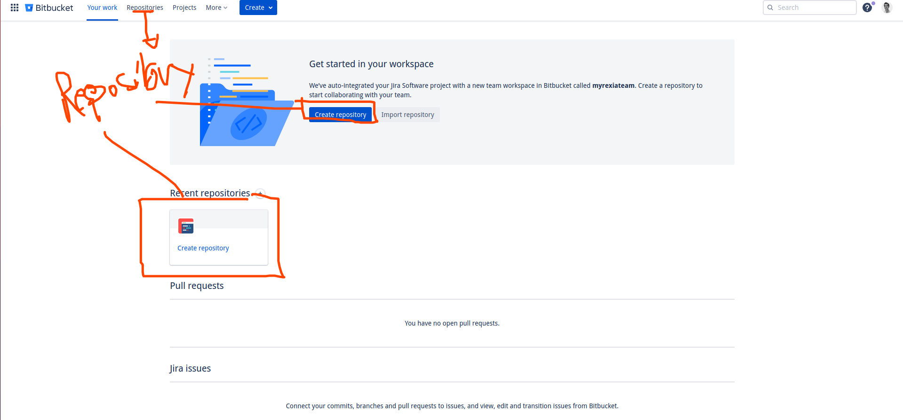
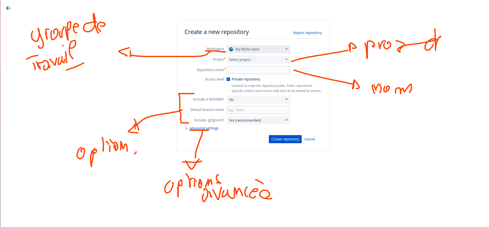
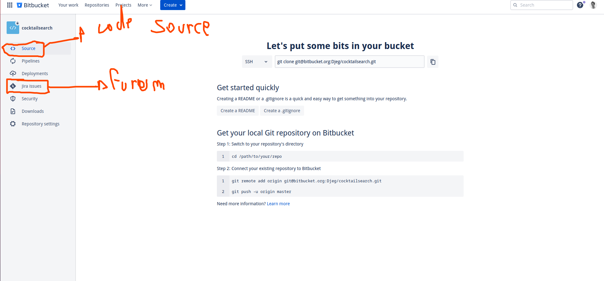
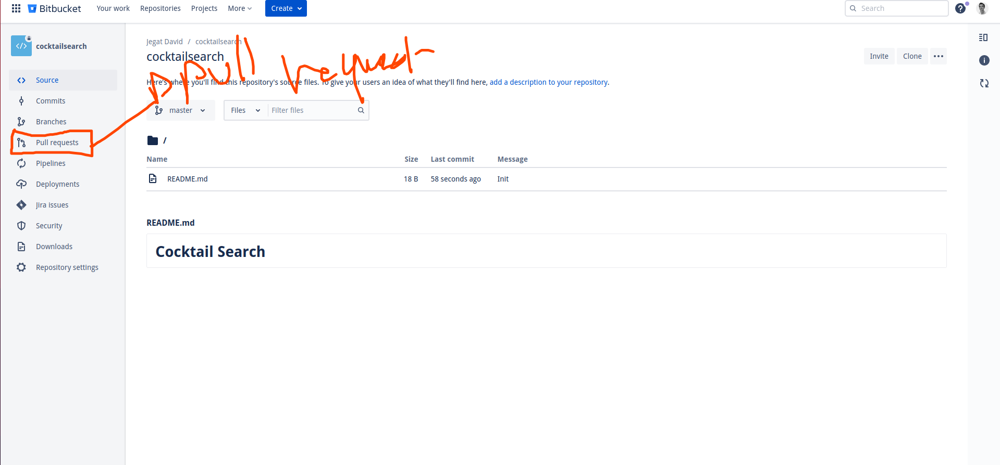

# Bitbucket

Bitbucket c'est le « remote » pour git utiliser par les outils « Atlassian ».

Atlassian c'était les leader du marché de la gestion de projet avant l'avénement de github. Aujourd'hui ces outils sont utilisé dans le secteur professionnel et nottament sur de très gros projet !

Son site officiel : https://bitbucket.org

## L'interface de Bitbucket

