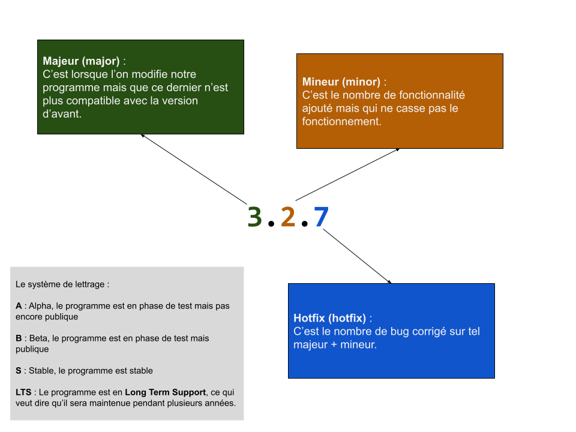
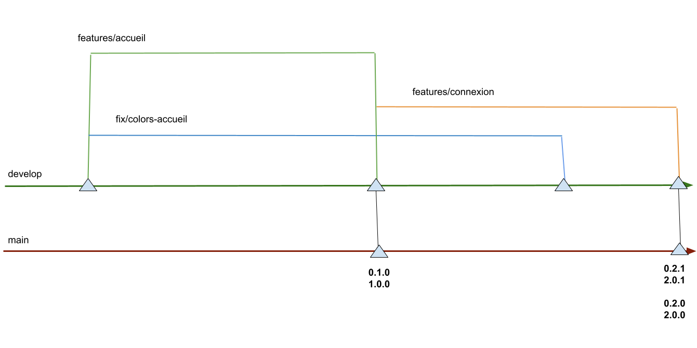

# Git Flow

Lorsque l'on travaille en équipe il est recommandé de suivre une méthodologie préscise en ce qui concerne nos branches. Il éxiste beaucoup de méthodologue différente, mais la plus populaire est **git flow**.

Avant de comprendre **git flow** il faut comprendre le système de `release`. Une `release` c'est une version donnée de votre programme, chaque version est nommé `release`.

Les release de `git flow` utilise la notation `semvers` afin de définir la version d'un programme.

## Semvers (Semantic Versionning)

Aujourd'hui la plupart des programme utilise un système de version à 3 chiffres (ex: `3.0.5`, `14.16.9`)

## La branche principal : `main` (ou ancienement `master`)

Pour commencer à utiliser semvers avec git, il faut tou d'abord une branche principal. Cette branche principal contiendra les différentes version (en utilisant les `git tag`).

C'est de cette branche que les versions parte !

> **Ne jamais jamais jamais faire de commit directement sur cette branche !**

> Généralement cette branche reçoit que des **Pull Request** (**merge request**).

## La branche de développement : `develop`

C'est une branche, toujours à jour avec `main` qui contient le developpement actuel de notre programme. C'est ici, que l'on fait évoluer le code.

C'est la branche la **plus à jour** qui contient le tout dernier code du projet on parle aussi de `working branch` (la branche dans lequel on travaille).

> **Ne jamais jamais jamais faire de commit directement sur cette branche !**

> Généralement cette branche reçoit que des **Pull Request** (**merge request**).

> Cette branche sert de référence pour la création de vos brache perso ! **Attention à bien vous placer sur la branche develop afin de créer vos propres branche**.

## Les branches personnelles

Ce sont les branches que **vous** allez manipuler et sur lequel on effectue nos commits !

Il éxiste 2 sortes de branches (inspiré par semvers) :

- les `features` (fontionnalité) : Ce sont des branches qui ajoute des mineurs, ce sont elles qui aussi ajoute de nouvelles fonctionnalité à notre programme.

- les `fix` (bugs / correctif) : Ce sont des branch qui ajoute des hotfix, ce sont elles qui corrige les bugs !

Une branche personnel doit toujours partir de la branch `develop` et doit contenir dans son nom `fix` ou `features` :

Example de nom de branche :

| nom de la branche      | valide |
| ---------------------- | ------ |
| changementCouleur      | non    |
| fix-couleur            | oui    |
| page-accueil           | non    |
| correctif-page-accueil | non    |
| features/page-accueil  | oui    |
| fix/page-accueil       | oui    |

> Généralement la forme la plus répandu est celle ci :
>
> `fix/nom-du-correctif`
>
> `features/nom-de-la-fonctionnalite`
>
> `fix/username/nom-du-correctif`
>
> `features/username/nom-de-la-fonctionnalite`

## Schèma récapitulatif

