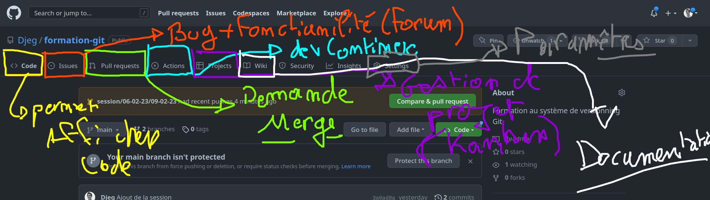
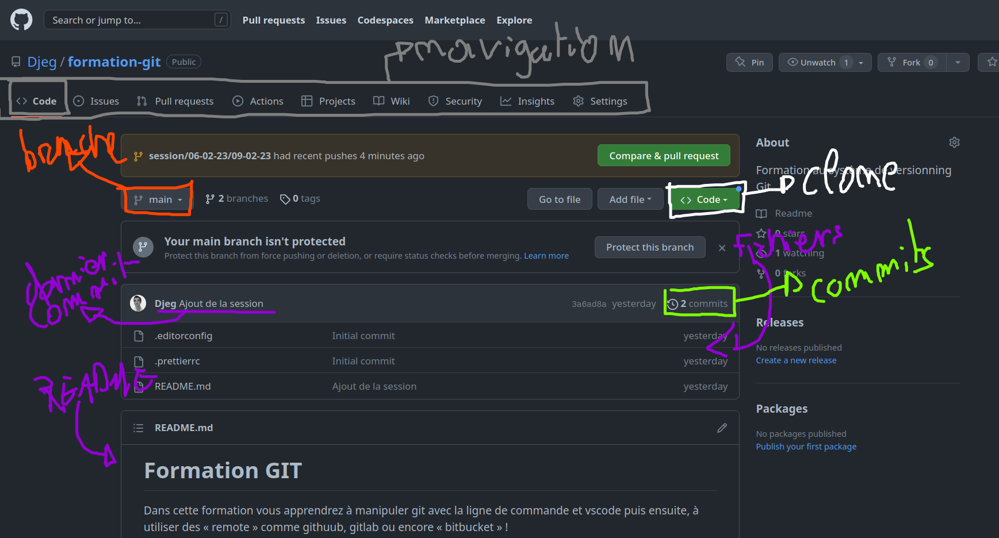
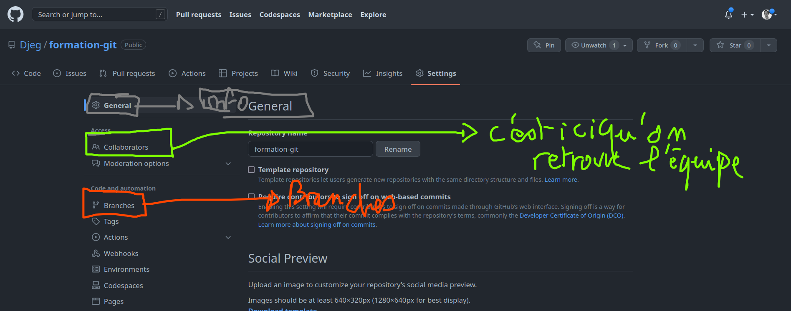
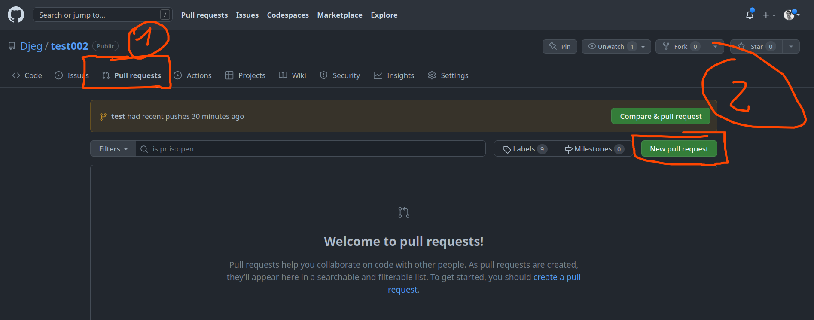
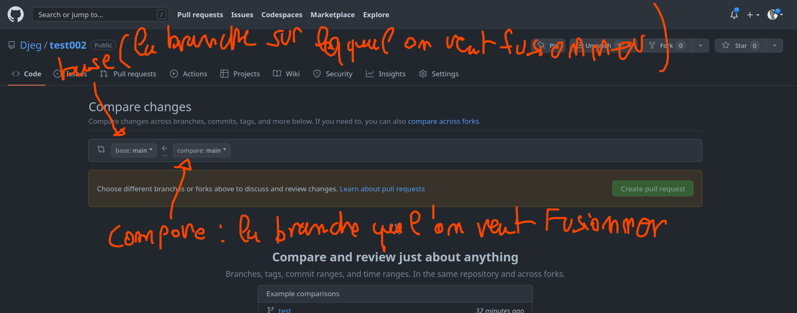
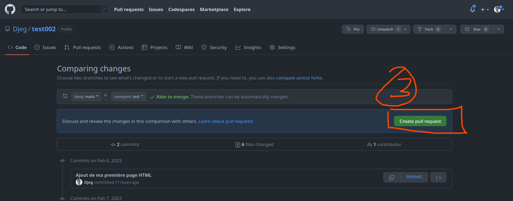
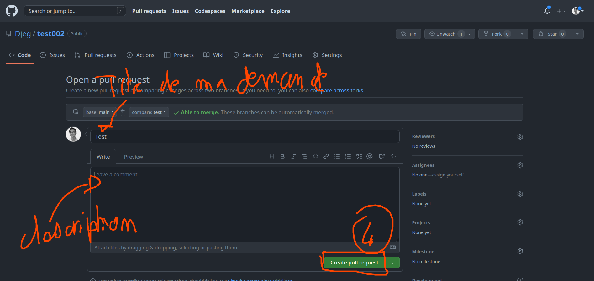

# Github

Github est le « remote » le plus utilisé dans le monde entier, c'est un véritable éspace pour les développeur qui sert généralement de CV.

Développé par Microsoft, il contient tout un panel de fonctionnalité permettant de travailler en équipe !

## Le repository

## Les « settings »

## Les « pull requests »

Une pull request c'est demande de merge. Par exemple, john demande à « fusionner » sa propre branche « branche-de-john » sur la branche principal « main » ou « master » !

Pour cela nous faisons des **pull requests**.

Une pull c'est une demande de merge, que l'on peut invalider, discuter, analyser avant de fusionner. C'est ce qui rend github si important aujourd'hui sur toutes les équipes du monde. Finalement, collaborer sur projet c'est maîtriser et faire des **pull request**.

Prenons un exemple avec le projet suivant : https://github.com/Djeg/test002

Ici, nous souhaitons « fusionner » la branche « test » avec la branche « main »

### Créer une pull request

### Gérer vos pull request

Une fois une pull request réaliser, vous pouvez la consulter.

Il est aussi possible de cliquer sur l'onglet `file changed` et de laisser une `review`. C'est la possibilité de commenté le code ligne par ligne et d'indiquer à la personne ce qui ne convient pas dans son code. Une fois toutes les lignes commentées cliqué sur `finish review`.

Lorsque la pull request est valide et qu'il n'y a plus de commentaire, vous pouvez cliquer sur `merge pull request` afin de fermer la demande et mettre le code sur la branche de destination.
