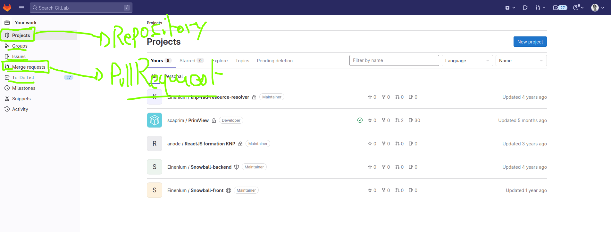
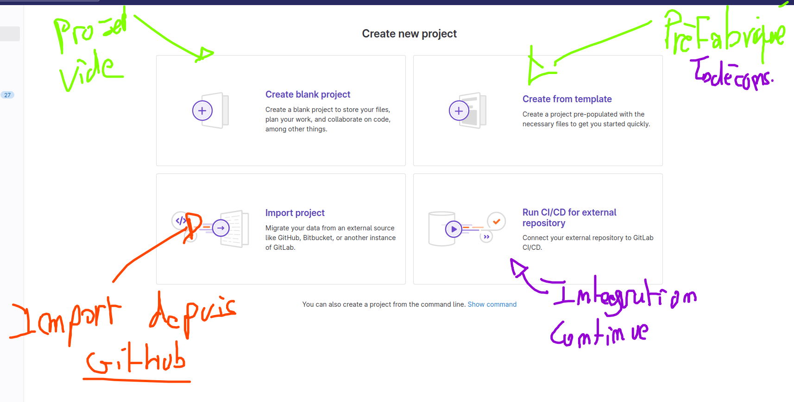
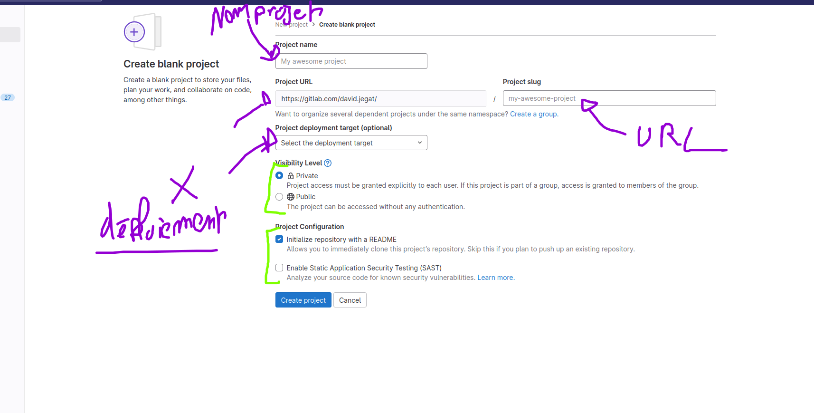
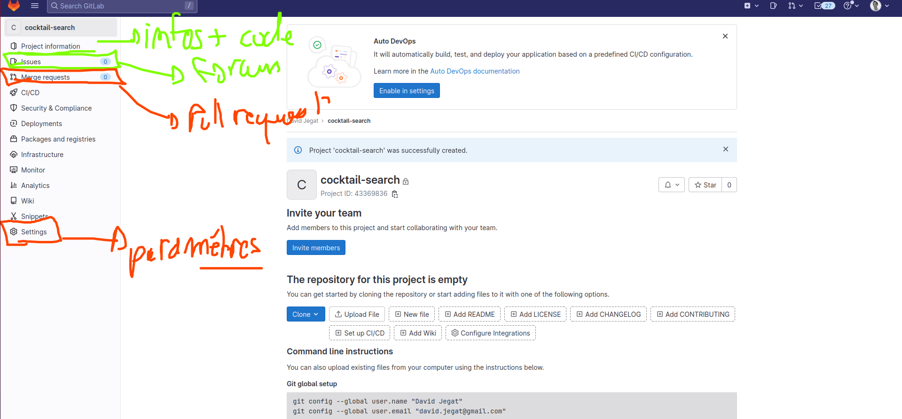

# GitLab

GitLab est une plateforme de « remote » concurrent de github. Il permet de faire sensiblement la même chose.

Il est utilisé dans le domaine professionnel. C'est problement celui le plus utilisé en france, moins chère et permettant de faire les même choses.

En plus de ça, il vient avec un SaS (Software as a Service), c'est à dire que vous pouvez téléchargez le code entier gitlab et le mettre chez vous, sur votre serveur. À ce moment gitlab vous appartient pleinement.

Son sit officiel : https://gitlab.com

## Interface gitlab

