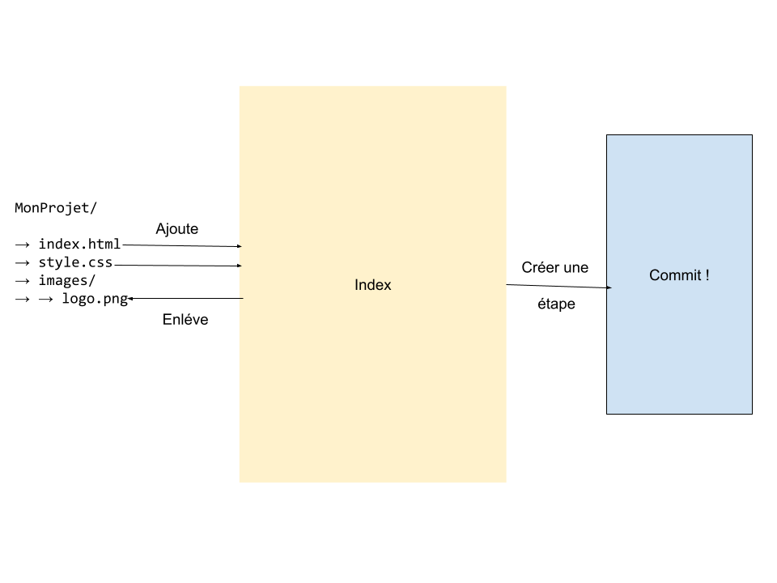
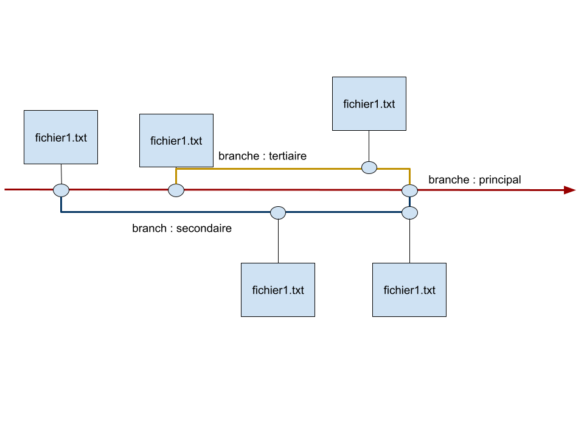

# Git : Présentation et concepts

Git est un outil de **versionning**, c'est la possibilité de garder la moindre trace de votre travaille. On vas pouvoir remonter dans le temps, et faire defiller toutes les versions de tout les fichiers d'un projet !

Attention à ne pas confondre git avec des outils de stockages « cloud » (dropbox, google drive, microsoft one drive ...) attention, il ne gére pas les versions et les branches. Ce sont des outils moins puissant mais plus facile d'accès.

Un développeur se doit de garder la trace de la moindre ligne de code depuis le début du projet jusqu'a la fin. L'outil le plus utilisé pour le versionning est **git**.

## Git : Le commit

Git est organisé en « étapes ». Chaque étapes de votre projet est ce que l'on appel un **commit** :

## Git : L'indexation

Pour pouvoir réaliser nos étapes ou **commit** nous avons besoin « d'indéxer » (ça veut dire prendre en compte) nos fichiers et dossiers :

Comme l'image le montre plus haut, il est possible d'ajouter et enlever des fichiers de l'index. C'est ce dernier (l'index) qui est utilisé pour réaliser nore étape (**commit**) !

## Git : La branche

Dans un projet nous pouvons avoir plusieurs « lignes de vie », permettant de travailler plus simplement en équipe :

## Déroulement d'un projet

Généralement chaque développeur possède son projet git, dans ce proejt éxiste une branche principal (**main** ou **master**).

Lorsqu'un développeur commence à travailler il doit **impérativement et obligatoirement créer sa propre branche !!!**

Donc, chaque développeur possède son propre espace, sa propre branche.

Une fois, le travaille d'un développeur terminé, sa branche est « **merged** » dans la branche principal.
