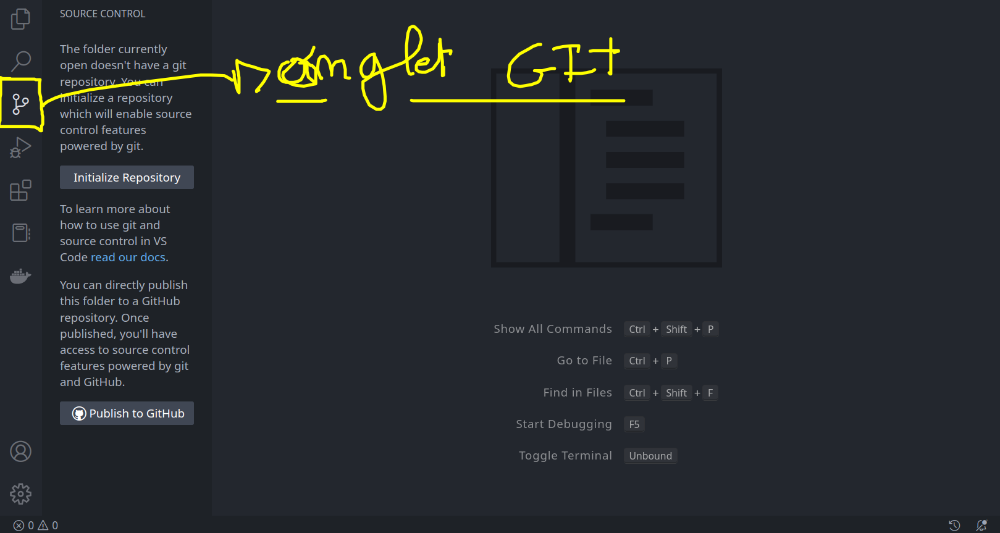
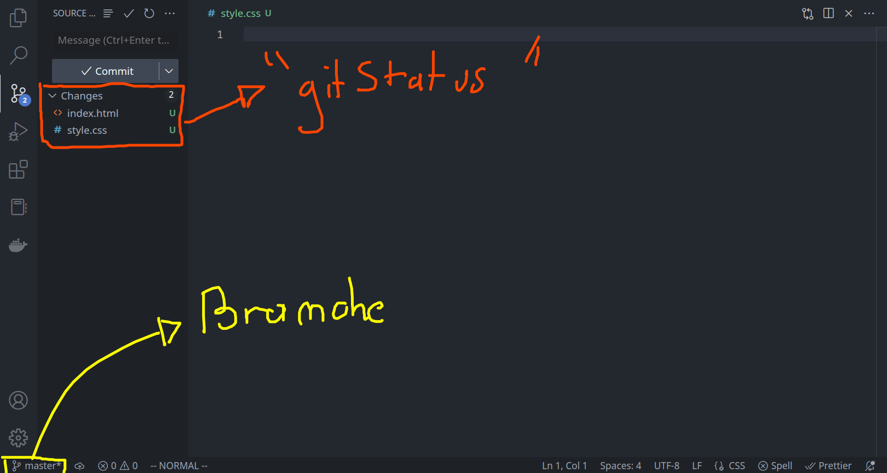
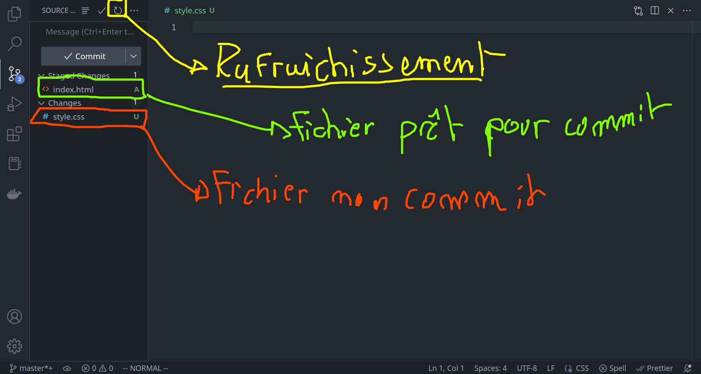
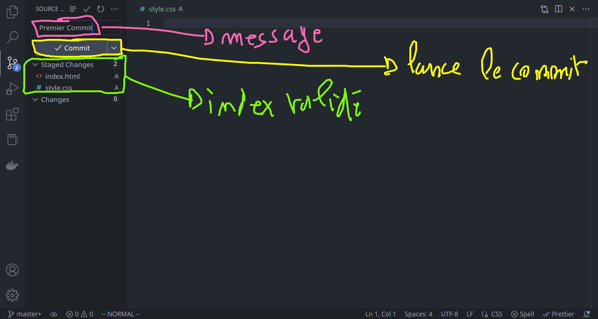
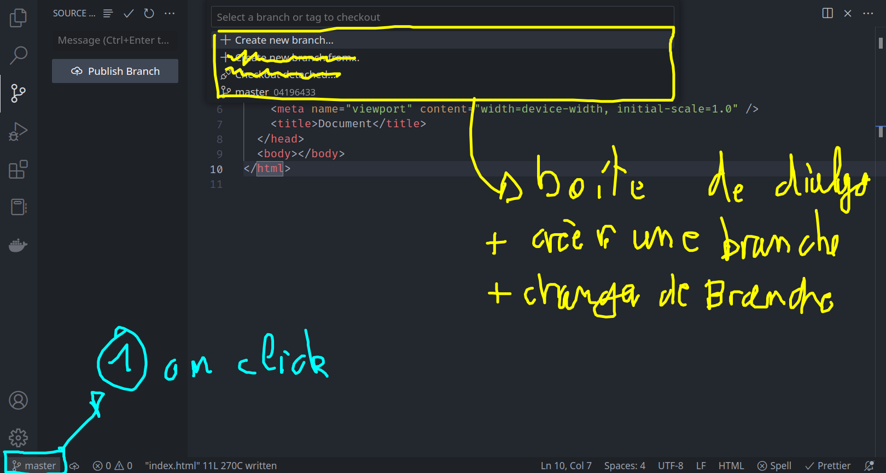

# Git : Avec VSCode !

Il est possible d'utiliser VSCode plutôt que le ligne de commande. C'est bien plus rapide et surtout, pas besoin de se souvenir de toutes les commandes !

## Créer un nouveau projet

Commençons par créer un tout nouveau projet :

```bash
$ mkdir monNouveauProjet
$ cd monNouveauProjet
$ code .
```

Voici à quoi doit ressembler votre éditeur de code :

o

Il est possible d'initialiser un projet git directement avec VSCode :


## L'indexation et les commits

Vous pouvez à tout moment consulter le `git status` de votre projet en cliquant sur l'onglet control de source :





Pour réaliser son premier commit il suffit de rentrer un message et de cliquer sur le bouton « commit » :



## Créer, changer de branches

Il est possible à tout moment de créer ou changer de branche très facilement avec vscode :



> **Entrainez-vous**
>
> Commencer par créer un nouveau projet (créer un nouveau dossier), dans le dossier de votre choix en utilisant le terminal ou votre explorateur de fichier
>
> Ouvrir le dossier avec VSCode
>
> Initialiser un projet git en utilisant vscode
>
> Créer 2 fichier : `index.html` et `style.css` et réaliser votre premier commit
>
> Créer une nouvelle branche `ma-branche`
>
> Créer un nouveau fichier `src/index.js` ainsi qu'un commit
>
> Rendez-vous sur la branche principal !
